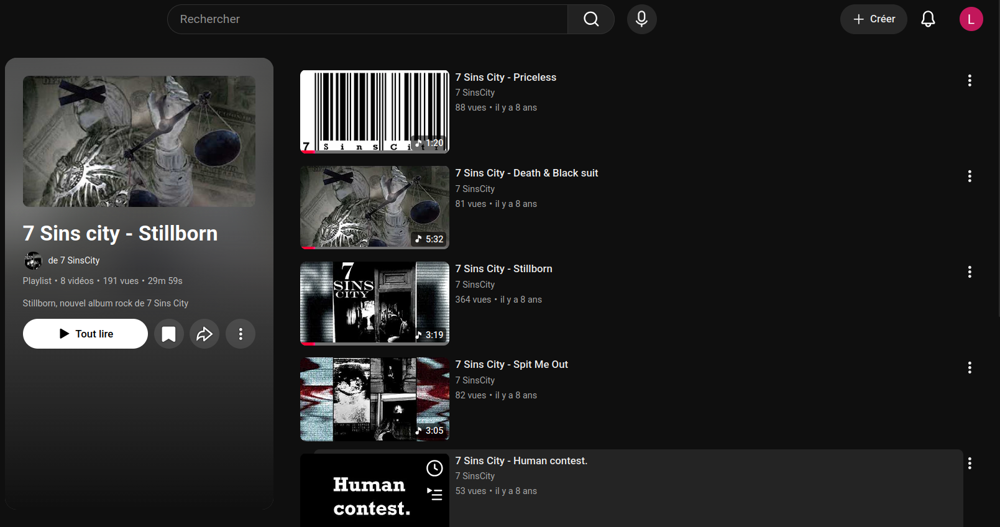

# YouTube Playlist Time

A lightweight browser extension that displays the **total duration of the videos currently loaded** in a YouTube playlist, directly alongside YouTube's existing playlist information.



## Features

* Displays the total duration of all currently loaded videos in a playlist.
* Adds the duration next to YouTube's existing playlist information.
* Automatically updates when additional videos are loaded.
* Only counts videos that are actually present in the page.
* Keeps the displayed total synchronized with the videos currently available in the DOM.
* Preserves the calculated total when the page is refreshed and avoids double-counting already processed videos.

## How It Works

YouTube progressively loads videos when a playlist is long. This extension calculates the duration based only on the videos currently loaded in the page.

The process is simple:

1. The extension detects videos loaded in the playlist.
2. It reads the duration of each video.
3. It adds the durations together.
4. The total is displayed alongside YouTube's existing playlist information.
5. When YouTube loads additional videos, the extension updates the total automatically.

For example, if YouTube initially loads 20 videos, the displayed duration represents those 20 videos. After scrolling and loading another batch of videos, the extension includes the newly loaded videos in the calculation.

> **Important:** The displayed duration represents the total duration of the videos currently loaded by YouTube. It may therefore be lower than the actual total duration of the entire playlist until all videos have been loaded.

## Example

YouTube normally displays information such as:

```text
Playlist · 8 videos · 191 views
```

With the extension installed:

```text
Playlist · 8 videos · 191 views · 29m 59s
```

The final duration is calculated dynamically from the videos currently loaded in the playlist.

## Long Playlists

For large playlists, YouTube does not necessarily load every video immediately.

The extension therefore does **not** attempt to guess the duration of unloaded videos. Instead, it works incrementally:

```text
Initial load
    ↓
Loaded videos detected
    ↓
Durations calculated
    ↓
Total displayed
    ↓
More videos loaded
    ↓
Total updated
```

This makes the displayed value accurate for the content currently available in the page while remaining compatible with YouTube's lazy-loading behavior.

## Installation

### Firefox

Install the extension from [Mozilla Add-ons](https://addons.mozilla.org/fr/firefox/addon/youtube-playlist-time/)

### Chrome

I did not pay required $5 to publish on Chrome Web Store.
You can install manually by following "For developpers" instructions and then load extension locally on your browser.

### For developpers

1. Download source files
2. use command "npm i"
3. use command "npm run build"
4. A "dist" folder is created automaticaly
5. "assets" folder, manifest.json and popup.html may be compressed inside a zip
6. The zip is the usable extension

## Limitations

* Only videos loaded by YouTube are included.
* Unloaded videos are not counted.
* The total may increase as more videos are loaded.
* Changes to YouTube's DOM structure may require future updates to the extension.

## Privacy

The extension only reads video information from the YouTube playlist page to calculate the displayed duration.

No playlist data needs to be sent to an external server.

## License

Free to use for personnal use, MIT Licence

### Made by Lucas PARISOT
